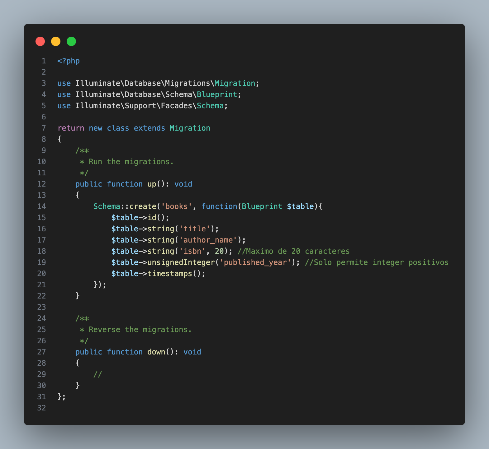
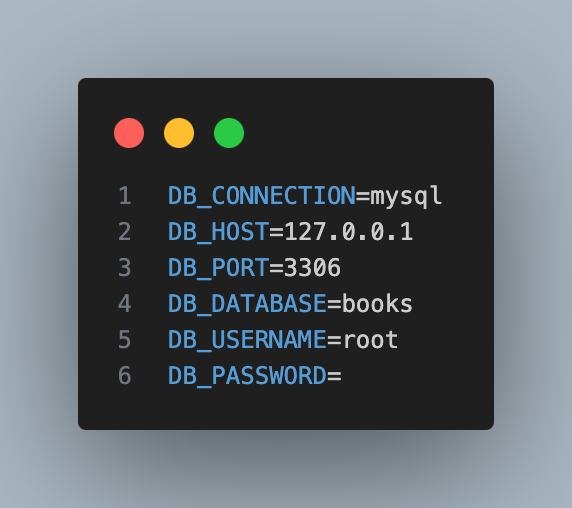

# Sistema de gestión una biblioteca

Desarrollado por [Pablo Elías Ramírez Escalante](https://github.com/RE-Pablo), este proyecto es un sistema básico de gestión de una biblioteca que se centra en operaciones CRUD para libros, utilizando Eloquent ORM de Laravel.

## Descripción del proyecto

El proyecto implica los siguientes pasos:

### Paso 1: Configuración del proyecto

1. *Inicialice un proyecto Laravel en la carpeta `htdocs`:* cree un nuevo proyecto Laravel usando Composer.
```bash
composer create-project laravel/laravel BookStore
```
2. *Inicialización del control de versiones:* inicie un repositorio remoto Git en la carpeta del proyecto
```bash
cd BookStore

git init

git add <archivos>

git commit -m "commit"

git branch -M master

git remote add origin https://github.com/RE-Pablo/Book-Store.git
```

### Paso 2: Diseñar bases de datos y modelos

1. *Cree el modelo de libro y la migración:*
```bash
$php artisan make:model books

$php artisan make:migration books
```
2. *Analice la entidad del libro:* céntrese en el libro como entidad principal, con atributos como `title, author_name, isbn y pubished_year.`
<p align="center">
    
</p>

3. *Configurar la conexión a la base de datos en `.env`:*

<p align="center">
    
</p>

4. Crear la base de datos `books` en `localhost/phpmyadmin/`

5. *Migrar tabla(s) a la base de datos:*
```bash
$php artisan migrate
```

### Paso 3: Controladores y lógica empresarial

1. *Creación del controlador:* BookController para gestionar los datos del libro.
```bash
$php artisan make:controller BookController
```
2. *Defina métodos CRUD:* incluya métodos para operaciones CRUD dentro del controlador.

### Paso 4: Construir vistas

1. *Diseño y vistas de inicio:* use plantillas de Blade para un diseño básico, incluida una vista de inicio que enumera todos los libros con opciones para manipular estos registros.
2. *Formularios:* creación y edición de formularios que requieren atributos de libros.

### Paso 5: Rutas

1. *Definir rutas:* establezca rutas para diversas operaciones y envíos de formularios en el archivo `web.php`.

### Paso 6: Prueba y depuración

1. *Pruebas manuales:* pruebas manuales exhaustivas de todas las funcionalidades CRUD.

### Paso 7: Control de versiones y documentación

1. *Confirmaciones de Git:* mensajes de confirmación regulares y descriptivos.
2. *Archivo README:* instrucciones de configuración detalladas, funciones y orientación sobre cómo acceder y probar las operaciones CRUD.

## Entregables

- **URL del repositorio de GitHub:**

[](https://github.com/RE-Pablo/Book-Store)
- **Demostración del proyecto:**

[](https://youtu.be/XBNqi7PXOR0)

## Instrucciones de configuración

1. *Instalar dependencias:*
[](https://getcomposer.org/)
[](https://www.apachefriends.org/es/index.html)

2. *Clonar el repositorio en la carpeta `htdocs`:*
```bash
git clone https://github.com/RE-Pablo/Book-Store.git
```
3. Abra XAMPP y ejecute: `Apache Web Server` y `MySQL Database`

4. Cree la base de datos `books` en `localhost/phpmyadmin/`
5. Pruebe el codigo en su buscador: `localhost/BookStore/public/books`

## Características

- Operaciones CRUD para libros.
- Interfaz de usuario simple e intuitiva
- Laravel Eloquent ORM para operaciones eficientes de bases de datos

## Pruebas

- Pruebas manuales de todas las funcionalidades CRUD.
- Garantizar la validación adecuada y el manejo de errores.

## Contribución

- [Pablo Elías Ramírez Escalante](https://github.com/RE-Pablo) - Desarrollador principal